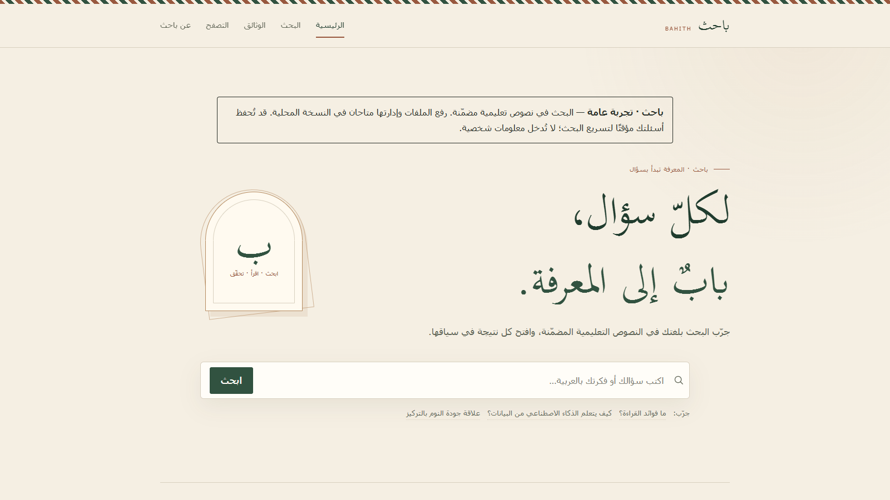

<div dir="rtl">

# باحث — بحث دلالي عربي

تطبيق ويب صغير ومفتوح المصدر يفهم اللغة العربية، ويرتّب النصوص حسب
**معناها** لا حسب كلماتها. مبني على نموذج
[Harrier-Arabic-Matryoshka-0.6B](https://huggingface.co/Omartificial-Intelligence-Space/Harrier-Arabic-Matryoshka-0.6B).



---

## مقدّمة

«باحث» تجربة موجزة لمحرّك بحث دلالي عربي. اكتب سؤالًا أو فكرة بلغتك،
وسيُعيد لك التطبيق أقرب الجمل من المجموعة المرفقة في المعنى — حتى وإن
كانت تستخدم كلمات مختلفة تمامًا عن سؤالك.

الفرق بين البحث الدلالي والبحث التقليدي بسيط: الأخير يبحث عن مطابقة
حرفية للكلمات، أمّا الأوّل فيُحوّل النصّ إلى متّجه عددي يلتقط معناه،
ثم يقارن المتّجهات. النتيجة: تستطيع أن تسأل عن «فوائد القراءة وتطوير
العقل» فيُعيد لك جملة عن «النوم الجيد يحسّن الذاكرة» لأنّها قريبة في
المعنى.

---

## المميّزات

- واجهة ويب باللغة العربية (محاذاة من اليمين إلى اليسار) بأربع صفحات:
  الرئيسية، البحث، التصفّح، عن المشروع.
- واجهة سطر أوامر (CLI) للاستعلام السريع من الطرفية.
- اختيار حيّ لأبعاد التضمين (Matryoshka): من 64 إلى 1024 بُعدًا، مع
  إعادة ترتيب فوريّة للنتائج عبر HTMX دون إعادة تحميل الصفحة.
- لا تسجيل دخول، ولا قاعدة بيانات. البحث نفسه يعمل محليًّا بعد تنزيل
  النموذج، بينما تعتمد الواجهة على موارد CDN للخطوط وHTMX ما لم تُستضف
  هذه الموارد محليًّا.
- مفتوح المصدر بترخيص MIT.

---

## متطلّبات التشغيل

| المتطلّب | الحدّ الأدنى |
| --- | --- |
| Python | 3.10 أو أحدث |
| الذاكرة | 2 جيجابايت متاحة على الأقل |
| القرص | ~2 جيجابايت لتنزيل النموذج |
| الشبكة | مطلوبة للتنزيل الأوّل للنموذج وموارد الواجهة من CDN |

---

## التثبيت

### على ويندوز (PowerShell)

```powershell
git clone https://github.com/Abdulrahman-S-Asiri/bahith.git
cd bahith
python -m venv .venv
.\.venv\Scripts\Activate.ps1
pip install -r requirements.txt
```

### على ماك أو لينكس (bash)

```bash
git clone https://github.com/Abdulrahman-S-Asiri/bahith.git
cd bahith
python3 -m venv .venv
source .venv/bin/activate
pip install -r requirements.txt
```

> عند التشغيل لأوّل مرّة، سيُنزَّل النموذج (~1.2 جيجابايت) إلى مجلّد
> الكاش الخاصّ بـ Hugging Face، وقد يستغرق ذلك بضع دقائق حسب سرعة
> الشبكة.

---

## تشغيل التطبيق

```bash
uvicorn app:app --port 8000
```

ثم افتح المتصفّح على العنوان: <http://localhost:8000>

سترى رسالة `Application startup complete.` في الطرفية بعد انتهاء تحميل
النموذج. الاستعلامات بعد ذلك تستغرق أجزاء من الثانية.

---

## الاختبار

```bash
python -m unittest discover
```

تتحقق الاختبارات من صحة اقتطاع متجهات Matryoshka، وإعادة التطبيع بعد
الاقتطاع، وترتيب النتائج، ومقاييس التقييم، وثبات بيانات `corpus.json`.
ولا تحتاج هذه الاختبارات إلى تحميل النموذج الحقيقي.

لتشغيل تقييم الاسترجاع الكامل على النموذج الحقيقي:

```bash
python evaluate.py
```

يقيس هذا الأمر أكثر من 100 استعلام عربي مصنّف، ويعرض النتائج العامة
وتحليلًا حسب نوع السؤال والتصنيف، مع أمثلة على النتائج التي لم تظهر في
المركز الأول.

آخر نتيجة على 120 استعلامًا عربيًا و30 نصًا، عند البعد الافتراضي 1024:

| المقياس | النتيجة |
| --- | ---: |
| MRR | 0.933 |
| NDCG@5 | 0.938 |
| P@1 | 0.908 |
| P@3 | 0.319 |

هذه أرقام قوية لتجربة صغيرة، لكنها ليست بديلًا عن اختبار مجموعة أكبر
قبل الاستخدام الإنتاجي.

---

## الاستخدام

### من الواجهة

1. افتح <http://localhost:8000> ثمّ اكتب سؤالًا في صندوق البحث، مثلًا:
   `ما فوائد القراءة؟`
2. تظهر النتائج مرتّبة من الأعلى تشابهًا إلى الأقل.
3. على صفحة `/search` يمكنك تغيير «بُعد التضمين» (64، 128، 256، 512،
   768، 1024) لمشاهدة كيف تتغيّر النتائج عند الاكتفاء ببعض الإحداثيات
   من المتّجه فقط.
4. صفحة `/browse` تعرض النصوص مصنّفةً حسب المجال.

### من سطر الأوامر

```bash
python search.py "ما أهمّية الذكاء الاصطناعي في حياتنا؟"
```

ستحصل على أعلى خمس نتائج مع درجة التشابه لكلٍّ منها.

---

## بنية المشروع

```
bahith/
├── app.py              تطبيق FastAPI ومسارات الويب
├── search.py           محرّك البحث وواجهة سطر الأوامر
├── evaluate.py         قياس جودة الاسترجاع عبر أبعاد Matryoshka
├── corpus.json         مجموعة النصوص العربية المرفقة
├── requirements.txt    حزم Python المطلوبة
├── tests/              اختبارات صحة المتجهات والمقاييس والبيانات
├── templates/          قوالب Jinja2 لصفحات الموقع
├── static/
│   ├── css/            ملفّ التصميم
│   ├── js/             تعزيزات بسيطة لواجهة المستخدم
│   └── img/            أيقونات SVG
├── LICENSE
└── README.md
```

---

## استخدام بيانات خاصّة

كلّ ما عليك هو استبدال محتوى `corpus.json` بقائمتك الخاصّة. كلّ عنصر
كائن JSON يحتوي على ثلاثة حقول:

```json
[
  {
    "id": 1,
    "category": "any-tag",
    "text": "النصّ العربيّ هنا..."
  }
]
```

- `id`: معرّف رقمي فريد.
- `category`: تصنيف نصّي قصير (يظهر في صفحة التصفّح).
- `text`: النصّ نفسه. لا يوجد حدّ أقصى عمليّ للطول؛ النموذج الأساسيّ
  يدعم سياقًا حتّى 32 ألف رمز.

أعِد تشغيل التطبيق بعد التعديل وسيُعاد ترميز المجموعة من جديد.

---

## حلّ المشكلات الشائعة

**فشل تحميل النموذج أو انقطاع الاتّصال.**
زِد مهلة التنزيل ثمّ أعِد المحاولة:

```bash
HF_HUB_DOWNLOAD_TIMEOUT=120 uvicorn app:app
```

على PowerShell:

```powershell
$env:HF_HUB_DOWNLOAD_TIMEOUT=120; uvicorn app:app
```

**رسالة `Address already in use` أو المنفذ 8000 مشغول.**
شغّل التطبيق على منفذ آخر:

```bash
uvicorn app:app --port 8001
```

**ظهور النصّ العربي مشوّهًا في الطرفية على ويندوز.**
عيّن ترميز UTF-8 قبل تشغيل CLI:

```powershell
$env:PYTHONIOENCODING="utf-8"; python search.py "ما فوائد القراءة؟"
```

**تحذير حول الـ symlinks على ويندوز.**
تحذير غير مؤذٍ من Hugging Face. تجاهله، أو فعّل «وضع المطوّر» من
إعدادات ويندوز لتفعيل الروابط الرمزيّة وتقليل استهلاك القرص.

**نفاد الذاكرة عند تحميل النموذج.**
يحتاج النموذج ~2 جيجابايت من الذاكرة الحرّة. أغلق التطبيقات الثقيلة
ثمّ أعد المحاولة.

---

## الترخيص والشكر

- الترخيص: [MIT](LICENSE)
- النموذج: [Omartificial-Intelligence-Space/Harrier-Arabic-Matryoshka-0.6B](https://huggingface.co/Omartificial-Intelligence-Space/Harrier-Arabic-Matryoshka-0.6B)
- النموذج الأساس: `microsoft/harrier-oss-v1-0.6b`

شكرًا لكلّ من يساهم في تطوير معالجة اللغة العربية.

</div>

---

## In English

**Bāḥith** is a small Arabic semantic search demo. It encodes a built-in
corpus of ~30 Arabic passages with the Harrier-Arabic-Matryoshka-0.6B
embedding model and lets you query in Arabic via either a FastAPI web
UI or a one-shot CLI. The Matryoshka dim toggle (64–1024) re-ranks
results live without re-running the model.

Quickstart:

```bash
git clone https://github.com/Abdulrahman-S-Asiri/bahith.git
cd bahith
python -m venv .venv && source .venv/bin/activate   # or .venv\Scripts\Activate.ps1 on Windows
pip install -r requirements.txt
uvicorn app:app --port 8000
```

Then visit <http://localhost:8000>.

Run deterministic tests without loading the real model:

```bash
python -m unittest discover
```

Run the full retrieval benchmark with the real model:

```bash
python evaluate.py
```

Latest benchmark snapshot on 120 Arabic queries and 30 passages at the default
1024 dimensions:

| Metric | Score |
| --- | ---: |
| MRR | 0.933 |
| NDCG@5 | 0.938 |
| P@1 | 0.908 |
| P@3 | 0.319 |

MIT licensed.
